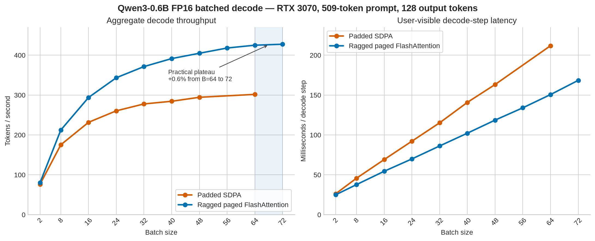

# Batched decode

## Implementations

The portable batch path combines independent request caches into zero-padded
contiguous tensors and calls PyTorch SDPA. It is used for CPU, MPS, and dense
caches. For a paged cache, this reference path gathers every request's physical
blocks before constructing the padded batch and materializes repeated K/V heads
for grouped-query attention.

The CUDA paged path keeps each request history in the shared physical block
pool. It flattens the query tokens and passes request boundaries, effective K/V
lengths, and a batched block table to variable-length FlashAttention. Only the
block-table rows are padded; the kernel does not gather or pad the actual K/V
states and handles grouped-query attention without materializing repeated K/V
heads.

Decode contributes one query token per active request, so its query tensor is
naturally rectangular. The ragged dimension is the cached K/V history: each
request can have a different logical length and block count. Ragged batched
prefill is not implemented; prompts are still prefetched sequentially.

## Long-context benchmark

Both implementations were measured with the following setup:

- GPU: NVIDIA GeForce RTX 3070, 8 GiB
- Model: Qwen3-0.6B FP16
- Prompt: 509 actual tokens per request
- Generation: 128 tokens per request
- Cache: paged FP16, 16-token blocks
- Warm-up: one complete unmeasured generation
- Repetitions: 3
- Reported values: medians

`Decode step` is the latency to produce one token for every active request. It
is also the user-visible inter-token latency for each request in a fixed batch.
`Decode tokens/s` is aggregate batch throughput. Prefill and sampling are
excluded from these decode measurements.

| Batch | Padded SDPA step | Padded SDPA tok/s | Ragged paged step | Ragged paged tok/s | Throughput gain |
| ---: | ---: | ---: | ---: | ---: | ---: |
| 2 | 26.22 ms | 76.25 | 24.96 ms | 80.10 | 5.0% |
| 8 | 45.68 ms | 175.22 | 37.69 ms | 212.28 | 21.2% |
| 16 | 69.12 ms | 231.63 | 54.44 ms | 293.88 | 26.9% |
| 24 | 92.16 ms | 260.39 | 69.90 ms | 343.35 | 31.9% |
| 32 | 115.20 ms | 277.70 | 86.16 ms | 371.41 | 33.7% |
| 40 | 140.80 ms | 284.39 | 102.17 ms | 391.48 | 37.7% |
| 48 | 163.20 ms | 294.40 | 118.57 ms | 404.81 | 37.5% |
| 64 | 211.84 ms | 301.68 | 150.59 ms | 425.01 | 40.9% |

Additional ragged-paged measurements locate its practical saturation point:

| Batch | Decode step | Decode tok/s | Reserved request cache |
| ---: | ---: | ---: | ---: |
| 56 | 133.98 ms | 417.96 | 3.83 GiB |
| 64 | 150.59 ms | 425.01 | 4.38 GiB |
| 72 | 168.43 ms | 427.48 | 4.92 GiB |

Batch 64 to 72 increases aggregate throughput by only 0.6%, so this workload
practically saturates around batch 64. Batch 80 could not allocate its fixed KV
pool on the 8 GiB GPU.

## Interpretation

The improvement grows with batch size because the padded path creates
increasing amounts of redundant K/V traffic. It gathers pages, constructs a
contiguous padded batch, and expands GQA K/V heads before SDPA. Direct paged
attention reads the original cache through each request's block table and
logical length, reaching 40.9% higher throughput at batch 64.

Paged attention can show lower sampled GPU utilization while achieving higher
throughput. Allocated VRAM and GPU utilization measure different things: the
fixed KV pool keeps VRAM occupied for its lifetime, whereas utilization reports
how often kernels execute during the sampling interval. Removing copies makes
kernels finish sooner and exposes eager launch gaps, per-request cache writes,
block-table construction, and host-side sampling.

The benchmark's cache column reports active request reservations, not the
physical pool allocation. With `max_seq_len=704`, the batch-64 physical pool is
4.81 GiB while active requests reserve 4.38 GiB (640 rounded positions each).
The remaining 448 MiB is unused pool capacity. Model weights, CUDA state,
activations, attention workspace, and allocator-retained buffers consume the
rest of VRAM.

The next optimization targets the remaining eager overhead: reuse batched
block-table metadata, vectorize cache writes, then capture fixed batch/metadata
buckets with CUDA graphs.
