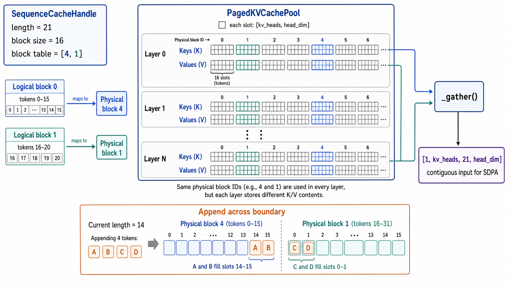

# Paged KV-cache

## Design

The runtime owns cache allocation. Models receive an explicit cache and depend
only on the protocols in `mini_llm/cache/contracts.py`; implementations live
in `mini_llm/cache/dense.py` and `mini_llm/cache/paged.py`.

The default paged backend stores each layer's keys and values as:

```text
[blocks, 16, num_kv_heads, head_dim]
```

A request handle contains its logical length, capacity, and ordered block
table. A physical block ID selects the corresponding K/V block in every layer.
The reference backend gathers pages into the ordinary SDPA layout.



The optional dense backend allocates contiguous per-request tensors:

```text
[1, num_kv_heads, capacity, head_dim]
```

Qwen3-0.6B uses `[1, 8, capacity, 128]`; Granite uses
`[1, 8, capacity, 64]`. The cache stores the original GQA key/value heads and
expands them to query-head count only during attention.

```text
cache bytes = layers × 2(K,V) × KV heads × capacity × head_dim × bytes/value
```

Both implementations expose the same append, reset, rollback, length, and
capacity operations. The runtime releases request caches when generation ends
or fails.

## Environment

- GPU: NVIDIA GeForce RTX 3070 (8 GiB)
- NVIDIA driver: 580.173.02
- CUDA: 13.0
- PyTorch: 2.13.0+cu130
- Models: Qwen3-0.6B and Granite-3.1-1B
- Precision: FP16
- Decode length: 16 tokens
- Warmups: 1
- Measured repetitions: 3
- Reported values: medians
- Paged-cache block size: 16 tokens

The end-to-end measurements include prompt preparation, cache allocation,
prefill, sampling, and decode through `Engine.generate()`.

## Paged-cache results

### Qwen3-0.6B

| Prompt tokens | TTFT | Prefill tokens/s | Decode TPOT | Decode tokens/s | Generated tokens | Cache |
| ---: | ---: | ---: | ---: | ---: | ---: | ---: |
| 36 | 20.51 ms | 1,770.60 | 19.34 ms | 51.71 | 16 | 7.00 MiB |
| 124 | 22.79 ms | 5,485.24 | 19.47 ms | 51.36 | 16 | 15.75 MiB |
| 509 | 41.80 ms | 12,234.10 | 19.81 ms | 50.47 | 16 | 57.75 MiB |

### Granite-3.1-1B

| Prompt tokens | TTFT | Prefill tokens/s | Decode TPOT | Decode tokens/s | Generated tokens | Cache |
| ---: | ---: | ---: | ---: | ---: | ---: | ---: |
| 59 | 33.51 ms | 1,770.66 | 18.43 ms | 54.25 | 16 | 3.75 MiB |
| 131 | 41.92 ms | 3,138.17 | 18.51 ms | 54.03 | 16 | 7.50 MiB |
| 515 | 101.79 ms | 5,069.41 | 18.80 ms | 53.19 | 16 | 25.50 MiB |

## Dense-cache baseline

### Qwen3-0.6B

| Prompt tokens | TTFT | Prefill tokens/s | Decode TPOT | Decode tokens/s | Generated tokens | Cache |
| ---: | ---: | ---: | ---: | ---: | ---: | ---: |
| 36 | 18.45 ms | 1,985.86 | 18.01 ms | 55.52 | 16 | 5.69 MiB |
| 124 | 18.60 ms | 6,789.21 | 18.07 ms | 55.35 | 16 | 15.31 MiB |
| 509 | 37.16 ms | 13,831.02 | 18.22 ms | 54.90 | 16 | 57.42 MiB |

### Granite-3.1-1B

| Prompt tokens | TTFT | Prefill tokens/s | Decode TPOT | Decode tokens/s | Generated tokens | Cache |
| ---: | ---: | ---: | ---: | ---: | ---: | ---: |
| 59 | 28.69 ms | 2,078.32 | 17.00 ms | 58.83 | 16 | 3.52 MiB |
| 131 | 36.69 ms | 3,602.14 | 17.01 ms | 58.78 | 16 | 6.89 MiB |
| 515 | 96.27 ms | 5,369.02 | 17.15 ms | 58.30 | 16 | 24.89 MiB |

## Comparison

| Model | Prompt tokens | Paged decode tokens/s | Dense decode tokens/s | Paged decode delta | Paged cache | Dense cache |
| --- | ---: | ---: | ---: | ---: | ---: | ---: |
| Qwen3-0.6B | 36 | 51.71 | 55.52 | -6.9% | 7.00 MiB | 5.69 MiB |
| Qwen3-0.6B | 124 | 51.36 | 55.35 | -7.2% | 15.75 MiB | 15.31 MiB |
| Qwen3-0.6B | 509 | 50.47 | 54.90 | -8.1% | 57.75 MiB | 57.42 MiB |
| Granite-3.1-1B | 59 | 54.25 | 58.83 | -7.8% | 3.75 MiB | 3.52 MiB |
| Granite-3.1-1B | 131 | 54.03 | 58.78 | -8.1% | 7.50 MiB | 6.89 MiB |
| Granite-3.1-1B | 515 | 53.19 | 58.30 | -8.8% | 25.50 MiB | 24.89 MiB |

The transparent paged backend is about 7-9% slower during single-request
decode. It gathers each layer's pages into a contiguous tensor before calling
PyTorch SDPA, while the dense backend can return a direct view into its cache.

Paged-cache capacity is rounded to complete 16-token blocks, so its allocation
overhead is most visible for short requests and becomes small at longer
sequence lengths. At this stage paging provides the storage foundation for
on-demand allocation, continuous batching, and prefix sharing; direct paged
attention is required for paging itself to improve decode speed.
